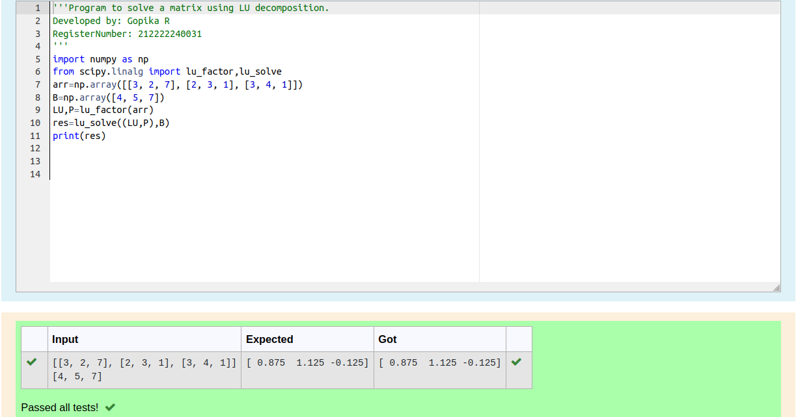
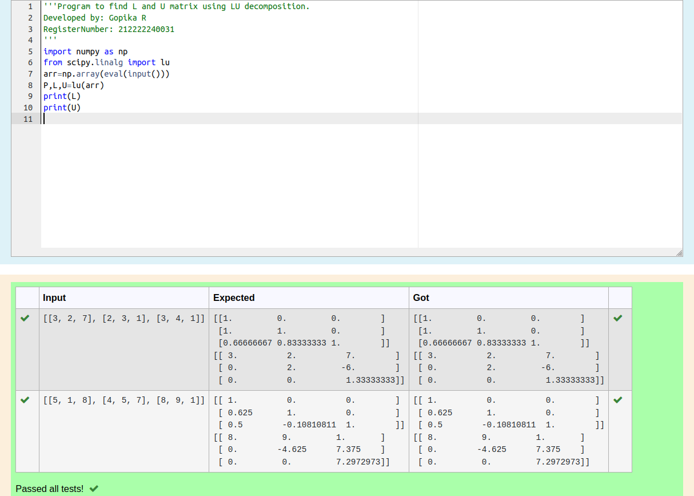

# LU Decomposition 

## Aim:
To write a program to find the LU Decomposition of a matrix.

## Equipments Required:
1. Hardware – PCs
2. Anaconda – Python 3.7 Installation / Moodle-Code Runner

## Algorithm:

## step 1:
 Import numpy library using import statement. 

## step 2:
  From scipy package import lu().

## step 3:
  Get input from user and pass it as an array.

## step 4:
  Get P, L, U matrix using lu()

## step 5:
  Print L and U matrix


## Program:

(i) To find the L and U matrix
```
Program to find the L and U matrix.
Developed by: Gopika R
RegisterNumber: 212222240031

import numpy as np
from scipy.linalg import lu
arr=np.array(eval(input()))
P,L,U=lu(arr)
print(L)
print(U)

```

(ii) To find the LU Decomposition of a matrix
```
Program to find the LU Decomposition of a matrix.
Developed by: Gopika R
RegisterNumber: 212222240031

import numpy as np
from scipy.linalg import lu_factor,lu_solve
arr=np.array([[3, 2, 7], [2, 3, 1], [3, 4, 1]])
B=np.array([4, 5, 7])
LU,P=lu_factor(arr)
res=lu_solve((LU,P),B)
print(res)


```

## Output:

## LU Decomposition to find the L and U matrix




## LU Decomposition to solve the matrix





## Result:
Thus the program to find the LU Decomposition of a matrix is written and verified using python programming.

